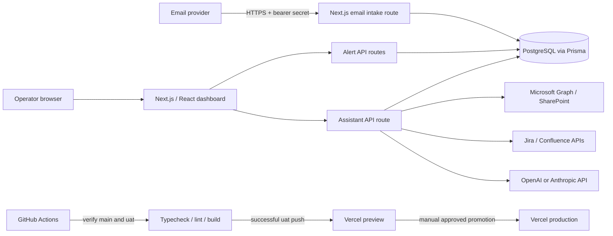

# Synopse Project Guide

This guide describes the current starter implementation, its operational workflows, recommended skills, technical choices, alternatives, and project glossary. “Implemented” means the code path exists; email-provider registration, database provisioning, API credentials, GitHub repository setup, and deployment secrets still need environment-specific configuration.

## 1. What Synopse Does

Synopse is an email-driven incident and alert triage application. It accepts alerts from multiple locations, assigns a P1-P4 priority and response SLA, stores the original email and incident lifecycle in PostgreSQL, and gives operators a daily queue, backlog, and AI assistant for alerts and operational knowledge.

The current project is a starter, not a fully connected production service: the inbound endpoint is ready for a mail provider to call, the live knowledge connectors require credentials, and the dashboard uses sample data if PostgreSQL is unavailable. Eight representative mock alerts are included as a shared fixture and can be seeded into PostgreSQL for a persistent demo.

## 2. Functional Workflow

### 2.1 Email to alert

1. An email system or forwarding service parses an inbound message and calls `POST /api/alerts/intake` with a bearer token.
2. The API checks the token, validates the required fields and size limits, and rejects duplicate `messageId` values.
3. A keyword-based classifier assigns P1, P2, P3, or P4. The initial targets are P1 = 30 minutes, P2 = 60 minutes, P3 = 240 minutes, and P4 = 480 minutes.
4. The original message is stored in `Synopse_RawAlerts`; parsed sender, recipient, location, subject, and body are stored in `Synopse_AlertDetails`. Status and severity reference the status/severity lookup tables, while dedicated audit rows and a general activity event record receipt.
5. The alert becomes available to the daily dashboard or backlog according to its creation date, current Eastern time, and status.

The classification rules are a starting point, not a trained model or configurable policy engine. Review and tune them against the organization’s incident policy before production use.

### 2.2 Daily dashboard and backlog

- Before 5:00 PM in `America/New_York`, the dashboard shows all alerts created on the current Eastern calendar date, regardless of whether they are Open, In progress, or Resolved.
- At or after 5:00 PM Eastern, the daily dashboard closes and shows no alerts for that day.
- Open and In progress alerts from earlier Eastern dates are listed in Backlog. After the cutoff, unresolved alerts from the current date also move into Backlog.
- Resolved alerts from earlier dates are excluded from the backlog; resolved alerts from today remain on the dashboard until its cutoff.
- An alert created after the cutoff is placed in Backlog while the daily dashboard is closed.
- The backlog is a computed view; it does not change the alert’s database status to a separate “Backlog” state.

The code uses the IANA zone `America/New_York`, which observes daylight saving time. Therefore “5 PM ET” means 5 PM local Eastern time, not a permanently fixed UTC-5 offset. The browser refreshes the alert lists every 30 seconds.

### 2.3 Manual triage

Operators can create an alert from the dashboard. With a configured database, `POST /api/alerts` stores it. Assignment and status actions call `PATCH /api/alerts/{reference}` and add activity records. Resolving an alert sets its close time; starting work records its first-response time. In sample mode these changes exist only in browser memory.

### 2.4 Assistant and knowledge lookup

1. The dashboard sends the operator’s question and selected model provider to `POST /api/assistant`.
2. The server gathers active alert context and relevant indexed `KnowledgeDocument` records from PostgreSQL when a database is configured.
3. It also searches any configured SharePoint, Jira, and Confluence connectors.
4. The server sends that context to either the OpenAI API or Anthropic API and returns the answer. Provider keys stay on the server.

The current database retrieval ranks records with simple keyword matching. The SharePoint/Jira/Confluence calls are live search adapters. There is no completed scheduled synchronization/indexing pipeline, vector database, semantic embedding search, or full RAG pipeline yet. Search coverage and answer quality depend on the connected provider’s permissions and search results.

## 3. Technical Workflow and Architecture



### Main code boundaries

- `src/app/page.tsx`: browser dashboard, filters, daily/backlog views, manual intake form, and assistant panel.
- `src/app/api/alerts/intake/route.ts`: authenticated email webhook, validation, priority classification, PostgreSQL insert, and raw-email retention.
- `src/app/api/alerts/route.ts`: alert listing by dashboard/backlog scope and manual alert creation.
- `src/app/api/alerts/[reference]/route.ts`: assignment and status updates.
- `src/app/api/assistant/route.ts`: context selection and server-to-server LLM requests.
- `src/lib/business-day.ts`: Eastern calendar-day and 5 PM cutoff calculations.
- `src/lib/knowledge-connectors.ts`: live SharePoint, Jira, and Confluence searches.
- `src/lib/prisma.ts`: shared Prisma client for PostgreSQL access.
- `prisma/schema.prisma` and `prisma/migrations/`: database schema and versioned migrations.
- `prisma/demo-alerts.json`: shared eight-alert fixture used by the browser fallback and database seeder.
- `prisma/seed.cjs`: idempotent seed for demo alerts, raw payloads, and initial audit entries; run with `npm.cmd run db:seed`.
- `.github/workflows/`: CI, UAT deployment, and manually triggered production promotion.

### Alert database tables

- `Synopse_AlertDetails`: primary alert record, including reference, parsed details, assigned user foreign key, current status/severity codes, and lifecycle timestamps.
- `Synopse_RawAlerts`: original raw email/manual/demo payload and optional unique provider message ID, linked one-to-one to an alert.
- `Synopse_AlertStatus`: status lookup (`OPEN`, `IN_PROGRESS`, `RESOLVED`) with display label and terminal-state metadata.
- `Synopse_AlertStatusAudit`: append-only record of each alert status change, actor, note, and timestamp.
- `Synopse_AlertSeverity`: P1-P4 lookup and the response SLA minutes for each severity.
- `Synopse_AlertSeverityAudit`: append-only record of severity changes, actor, note, and timestamp. The requested name `Synopse_AlerSeverityAudit` was corrected to `Synopse_AlertSeverityAudit`.
- `Synopse_Users`: operator directory with stable username, display name, optional email, active flag, and timestamps. Alert assignment references a user row; assignment display names remain compatible with the dashboard.
- `SynopseUsersAudit`: records user creation and assignment-backfill events, with an optional actor user and JSON details. It provides the audit structure for future directory edits.
- `ActivityEvent`: existing general event history for receipt, manual creation, assignment, and other activity; it complements rather than duplicates the dedicated status/severity audits.
- `KnowledgeSource` and `KnowledgeDocument`: existing connector configuration and indexed knowledge records.

### Request and release lifecycle

- Runtime request flow: browser or mail provider -> Next.js route handler -> validation/business rule -> Prisma query or mutation -> PostgreSQL -> JSON response.
- CI flow: pull requests and pushes to `main`/`uat` run dependency installation, Prisma client generation, TypeScript check, lint, and build.
- UAT flow: a successful push to `uat` triggers the dependent UAT deployment job. The job applies database migrations and deploys a Vercel preview.
- Production flow: manually run **Promote to production** from `uat`, enter `PROMOTE`, pass verification, then apply migrations and deploy. Configure GitHub environment reviewers for a human release gate.

## 4. Technical Choices and Alternatives

| Area | Current choice and reason | Viable alternatives and trade-offs |
|---|---|---|
| Browser UI | Next.js App Router, React, TypeScript, and CSS. Fits the existing project and provides typed UI plus server routes in one deployment. | Vite + React is lighter for a standalone SPA, but needs a separate API service. Vue/Svelte are also viable but would be a rewrite. |
| Server/API | Next.js route handlers on Node.js. A modular monolith keeps alert APIs, assistant calls, and UI close together and avoids service-to-service operations early on. | FastAPI/Python is a good alternative if the team is Python-first or needs substantial ML/data processing. It would add a second service and deployment. Express/Fastify are options for a separate Node API but duplicate some Next.js capability. |
| Database | PostgreSQL for durable alert, email, activity, and knowledge metadata storage. ACID transactions and mature indexing suit incident records. | Managed PostgreSQL services are deployment alternatives, not a different data model. MongoDB is less natural for these relational lifecycle records. |
| Database access | Prisma ORM provides a schema, generated TypeScript client, and migrations. | Drizzle or Kysely are lighter TypeScript-first SQL options. SQLAlchemy is appropriate with a Python/FastAPI backend. Raw SQL gives control but requires more mapping and maintenance. |
| Email intake | Authenticated HTTPS webhook. It lets a mail provider forward parsed fields while keeping provider-specific parsing outside the app. | Microsoft Graph subscriptions, Gmail API, SES inbound, or a mailbox polling worker can be added when a provider is chosen. Direct IMAP polling is more operationally fragile. |
| Priority classification | Small keyword-based rule set to make the starter usable and inspectable. | A configurable rule engine improves policy management. An ML/LLM classifier can help later but needs evaluation, guardrails, and human review for critical alerts. |
| LLM | OpenAI or Anthropic server APIs, selected per request. Simple to integrate and keys remain server-side. | Azure OpenAI or an enterprise-hosted model can meet organization-specific governance needs. A provider abstraction is advisable if models proliferate. |
| Knowledge connectors | Server-side live API search, using Microsoft Graph and Atlassian REST APIs. Keeps vendor access and credentials out of the browser. | Scheduled ingestion into a search index improves cross-source retrieval and auditability but adds sync jobs, permissions management, and stale-data handling. |
| Retrieval | Keyword matching against selected database records plus provider-native searches. Low infrastructure overhead for a starter. | PostgreSQL full-text search or `pgvector` embeddings improve relevance at additional indexing and evaluation cost. |
| Deployment | GitHub Actions for verification/promotion and Vercel for Next.js hosting. | Azure App Service/Container Apps, AWS, or another Node-capable host can be used. Match the host to the organization’s database, identity, networking, and compliance requirements. |
| Architecture | One modular application and PostgreSQL database. The current scope does not require microservices. | Add a background worker for slow/retryable email parsing or knowledge sync when needed. Split into independently deployed services only when scaling, ownership, isolation, or availability requirements justify distributed-system overhead. |

### Production-hardening priorities

1. Replace the starter shared Basic Auth gate with the organization’s SSO/identity provider and role-based authorization.
2. Connect a real inbound mail provider; add signature verification, bounded request-body reads, retry handling, and monitoring.
3. Review the keyword classifier and SLA targets with operations owners; define escalation and pause/resume rules.
4. Add tests for Eastern-time boundaries, duplicate email delivery, priority rules, permissions, and database migrations.
5. Decide whether to implement knowledge synchronization, permission-aware indexing, audit/retention rules, and semantic retrieval.
6. Add observability, backups, alerting on failed email ingestion, rate limits, and cost controls for LLM calls.

## 5. Project Skill Set

### Core skills for building and operating Synopse

- **Incident-management domain:** severity definitions, response/resolve SLAs, escalation paths, ownership, on-call workflows, and audit requirements.
- **Frontend engineering:** React, TypeScript, Next.js App Router, forms, accessible interaction, responsive CSS, and client/server boundaries.
- **Backend engineering:** Node.js, HTTP/REST, route handlers, input validation, authorization, error handling, idempotency, and API design.
- **Database engineering:** PostgreSQL, relational modeling, SQL, indexes, transactions, Prisma schema/client, and safe migrations.
- **Email systems:** MIME structure, parsing, webhook delivery, retries, duplicate detection, sender validation, and treatment of inbound content as untrusted.
- **Integration engineering:** Microsoft Graph/Entra permissions, Jira and Confluence APIs, OAuth client credentials, Atlassian API tokens, pagination, timeouts, and provider errors.
- **AI application engineering:** LLM APIs, context construction, retrieval quality, prompt-injection defense, citations, evaluation, privacy, and token/cost limits.
- **Security:** secret management, TLS, authentication, least privilege, data retention, audit trails, and secure handling of email and incident content.
- **DevOps/release engineering:** Git branching, GitHub Actions, environment secrets, CI gates, database migrations, Vercel deployments, rollback, and release approvals.
- **Quality engineering:** unit and integration tests, API contract tests, timezone/DST boundary tests, accessibility checks, and end-to-end workflows.

A small team can combine these responsibilities, but incident policy, access control, and production release ownership should have named reviewers.

## 6. Glossary and Abbreviations

### Application and web

- **API - Application Programming Interface:** a defined way for software components to exchange requests and responses.
- **App Router:** Next.js routing system based on files under `src/app`.
- **Backend:** server-side code that validates requests, applies rules, accesses data, and calls external providers.
- **Bearer token:** a secret sent in an HTTP `Authorization` header; possession grants the permissions associated with that token.
- **Client / client-side:** code running in the user’s browser. Provider secrets must not be placed here.
- **Endpoint / route:** a URL path and HTTP method handled by the server, such as `POST /api/alerts/intake`.
- **HTTP / HTTPS:** Hypertext Transfer Protocol; HTTPS is HTTP protected by TLS encryption.
- **JSON:** JavaScript Object Notation, a common structured data format for API requests and responses.
- **Next.js:** React framework used here for the browser application and Node.js server routes.
- **Node.js:** JavaScript runtime used to run the app server and development/build tools. It is not itself a browser UI framework.
- **npm:** Node Package Manager; installs project dependencies and runs scripts declared in `package.json`.
- **npx:** npm tool that runs a package executable, such as `npx prisma generate`.
- **React:** JavaScript/TypeScript library used to build the interactive user interface.
- **REST:** Representational State Transfer, a common HTTP API style using resources and methods such as GET, POST, and PATCH.
- **Route handler:** Next.js server function that implements an HTTP endpoint.
- **TypeScript / TSX:** JavaScript with static types; TSX allows JSX markup inside TypeScript React files.
- **Webhook:** an HTTP request one system sends to another when an event occurs. Here it is the planned email-to-alert delivery mechanism.

### Alert and time concepts

- **Backlog:** the computed view of unresolved alerts carried over from previous Eastern dates, plus unresolved alerts after the daily cutoff. It is not a separate alert status in PostgreSQL.
- **Cutoff:** daily dashboard close at 5:00 PM `America/New_York`.
- **ET / Eastern Time:** local civil time in the U.S. Eastern zone. This project uses `America/New_York`, so it switches between EST (UTC-5) and EDT (UTC-4) for daylight saving time.
- **EST / Eastern Standard Time:** the fixed UTC-5 standard-time offset. In everyday speech “EST” is often used year-round; for correct seasonal wall-clock behavior, the code uses the `America/New_York` time zone instead.
- **Idempotency / duplicate detection:** preventing a retry of the same message from creating a second alert. The current intake uses unique `messageId` values when the provider supplies them.
- **P1-P4:** project priority levels. P1 is highest; P4 is lowest. The actual classification policy must be agreed with the operations team.
- **SLA - Service Level Agreement:** target time for a response or resolution. This starter stores a response target in minutes; it does not yet implement contractual pause calendars or escalation automation.
- **Status:** lifecycle state (`OPEN`, `IN_PROGRESS`, `RESOLVED`). A resolved alert is still shown on today’s dashboard until cutoff.

### Data and persistence

- **ACID:** database transaction properties: atomicity, consistency, isolation, and durability.
- **CRUD:** create, read, update, and delete, the basic data operations. This starter supports alert creation, reading, and updates; it does not provide alert deletion in the UI.
- **Foreign key (FK):** database constraint connecting a record to its parent, such as an activity event to its alert.
- **Index:** database structure that speeds up selected searches and sorts at the cost of storage and write work.
- **Migration:** a versioned database change applied in a controlled sequence. `prisma migrate dev` is for local development; `prisma migrate deploy` applies checked-in migrations in deployment environments.
- **ORM - Object-Relational Mapper:** library that maps application objects to relational database operations.
- **PostgreSQL:** relational database storing alerts, original email content, activity events, and knowledge metadata.
- **Prisma (not “Prism”):** the ORM used by this project. `prisma/schema.prisma` describes database models; the Prisma CLI generates the TypeScript client and manages migrations; `@prisma/client` is the generated runtime library used by application code.
- **Primary key (PK):** unique database identifier for a row.
- **Schema:** definition of database tables/models, columns, types, relations, and constraints.
- **Unique constraint:** database rule preventing duplicate values, such as repeated message IDs.

### Email, integrations, and AI

- **Atlassian:** company providing Jira and Confluence, used here as external knowledge sources.
- **Basic Auth:** HTTP authentication scheme sending a username/password pair encoded in a header. It is not encryption by itself and must only be used over HTTPS; the starter shared-password gate should be replaced with SSO for broad production use.
- **Connector:** server-side adapter that translates Synopse’s search request into a vendor-specific API request and maps the vendor response into a common result format. It is not a live connection until its credentials, permissions, and endpoint configuration are provided.
- **Entra ID:** Microsoft identity platform formerly branded Azure Active Directory; it can issue application tokens for Microsoft Graph.
- **LLM - Large Language Model:** AI model that produces text from instructions and context. This project can call OpenAI or Anthropic models.
- **MIME - Multipurpose Internet Mail Extensions:** standard format for email headers, body types, and attachments. `rawEmail` is retained for audit; `text` and `html` are parsed representations.
- **Microsoft Graph:** Microsoft API used by the SharePoint connector to search permitted content.
- **OAuth 2.0 client credentials:** server-to-server authentication flow in which an application uses its tenant, client ID, and secret to obtain a short-lived access token.
- **Prompt injection:** untrusted text in an email or document attempting to change an AI model’s instructions. The assistant prompt tells the model to treat retrieved content as data, but this is a mitigation, not a guarantee.
- **RAG - Retrieval-Augmented Generation:** an approach where relevant source material is retrieved and supplied to an LLM. Synopse currently has basic keyword retrieval and live provider searches; it does not yet have a full vector-based RAG/indexing pipeline.
- **Regex / regular expression:** pattern language for finding text matches. The initial priority classifier uses regex patterns to detect terms such as `P1`, `critical`, or `service unavailable`.
- **SMTP - Simple Mail Transfer Protocol:** standard protocol for sending email. The starter does not run an SMTP server; an email platform must forward messages to its webhook.
- **Token:** in AI usage, a unit of text processed by a model; in authentication, a credential. The meaning depends on context.

### Development, deployment, and operations

- **CI/CD - Continuous Integration / Continuous Delivery (or Deployment):** automation that checks code and can deploy it after defined gates. GitHub Actions provides these workflows here.
- **CLI - Command-Line Interface:** program operated by typed commands in a terminal, for example `npm`, `npx`, `prisma`, or `git`.
- **Environment variable:** configuration value supplied to a process at runtime, commonly used for database URLs and provider credentials.
- **Git:** version-control system that records project changes and supports branches and collaboration.
- **GitHub Actions:** GitHub automation runner for CI checks, deployments, and approvals.
- **`main`:** primary integration branch in the documented release path.
- **`uat`:** User Acceptance Testing branch/environment used for business validation before production.
- **Production / prod:** live environment used by operators.
- **Vercel:** hosting/deployment platform used by the included workflow; another Node.js host can replace it.
- **`winget`:** Windows Package Manager CLI for installing Windows applications. It is an optional workstation setup tool, not a Synopse runtime dependency.
- **Environment secret:** sensitive configuration stored in GitHub/Vercel environment settings rather than committed to the repository.
- **UAT - User Acceptance Testing:** pre-production environment where users validate expected workflows and business behavior.

## 7. Common Commands

```powershell
npm install                 # Install Node.js dependencies
npx prisma generate         # Generate the typed database client
npm run db:migrate          # Create/apply a local development migration
npm run db:seed             # Insert the shared eight-alert demo fixture
npm run db:deploy           # Apply checked-in migrations in deployment environments
npm run dev                 # Start the local development server
npm run typecheck           # Check TypeScript types
npm run lint                # Run ESLint
npm run build               # Create a production build
```

`npm install` requires Node.js/npm. `winget` can install Node.js on Windows, but it is a workstation setup tool, not part of the application.

### Local PostgreSQL setup and troubleshooting

1. Install PostgreSQL for Windows using the installer linked from the official PostgreSQL download page. The database server and command-line tools are required; Stack Builder add-ons are optional. The default port is `5432`.
2. Confirm the server is running and accepting local connections with `pg_isready -h localhost -p 5432`.
3. Create a login role and database named `synopse`, or use matching names in `DATABASE_URL`. Prefer the lowercase role name; quoted mixed-case PostgreSQL role names are case-sensitive and must match the URL exactly. The role password is separate from the `postgres` administrator password and the pgAdmin master password. pgAdmin does not display saved passwords when reopening role properties.
4. Copy `.env.example` to `.env` and set `DATABASE_URL` to `postgresql://synopse:<URL_ENCODED_PASSWORD>@localhost:5432/synopse?schema=public`. The database role must be able to log in. `prisma migrate dev` may also need permission to create a shadow database; grant `CREATEDB` locally or provision a shadow database. Do not use a superuser account for normal application access.
5. URL-encode reserved characters in the password portion, for example `#` as `%23` and `@` as `%40`. Never commit `.env`; it is ignored by Git. Do not put pgAdmin's master password in `DATABASE_URL`.
6. In local development, leave `SYNOPSE_ACCESS_USER` and `SYNOPSE_ACCESS_PASSWORD` empty to bypass the starter Basic Auth gate. If both are set, the middleware requests Basic Auth even in development. Production requires strong values for both.
7. After migrations, run `npm.cmd run db:seed` to insert eight realistic mock alerts with raw payloads, severity/status lookup references, initial dedicated audit records, and general activity events. The browser imports the same JSON fixture as a fallback; successful API responses replace it with PostgreSQL data. The seeder is idempotent by alert reference.
8. On Windows PowerShell, if `npm` is blocked because `npm.ps1` is disabled by the execution policy, use `npm.cmd` (and `npx.cmd`) rather than changing the machine-wide policy. For example, run `npm.cmd run db:migrate`.
9. If migration output says the migration was applied and the database is in sync, but Prisma then reports `EPERM` renaming `query_engine-windows.dll.node`, the migration succeeded and the later client-engine replacement was blocked by a file lock. Stop the Next.js dev server and other Node/Prisma processes, run `npm.cmd run db:generate`, then restart with `npm.cmd run dev`. Do not rerun the migration solely to fix that DLL replacement error.
